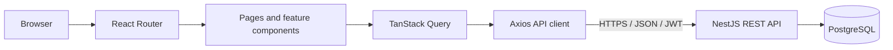
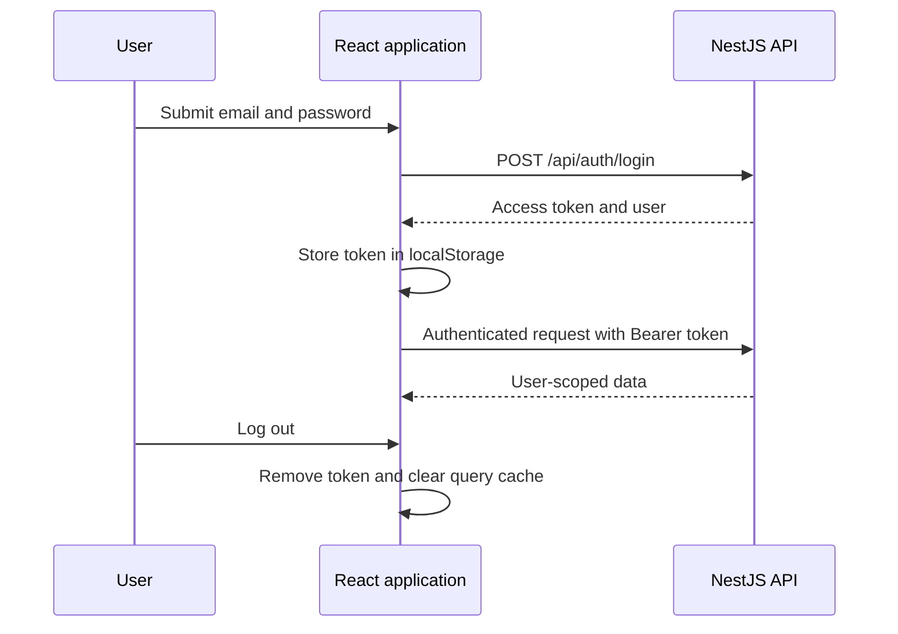
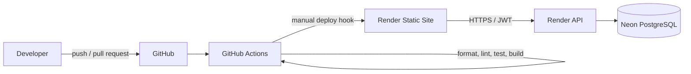

# InterviewLab Web

InterviewLab is a desktop-focused React application for organizing mock
technical interviews. Users can manage candidates, schedule and complete
interviews, record structured feedback, review candidate interview history,
and monitor activity from a dashboard.

## Live application

- Frontend: https://interview-lab-web.onrender.com
- API: https://interview-lab-api.onrender.com
- API documentation: https://interview-lab-api.onrender.com/api/docs
- [Architecture overview](https://github.com/gustid/interview-lab-api/blob/main/docs/architecture.md)

The API runs on a free Render web service. The first request after a period of
inactivity may take longer while the service starts.

## Features

- User registration, login, logout, and protected routes
- Candidate creation, listing, details, editing, and deletion
- Current and target roles for each candidate
- Candidate interview history
- Interview creation, listing, filtering, details, editing, deletion, and
  completion
- Filters by status, type, candidate, and date
- Structured feedback creation and editing for completed interviews
- Dashboard totals, completion rate, and latest interviews
- Loading, error, empty, confirmation, and success states

## Assumptions

- Users register and authenticate before accessing application data.
- Each user owns their candidates, interviews, and feedback.
- A candidate can participate in multiple interviews.
- Every interview belongs to one candidate.
- Feedback can only be created after an interview is marked as completed.
- Every interview has at most one consolidated feedback record.
- The application targets desktop screens for the current MVP. Responsive
  mobile navigation and layouts are outside the current scope.
- The JWT access token is temporarily stored in `localStorage`. A production
  evolution would use short-lived access tokens and secure HttpOnly cookies.
- Advanced cross-domain search and reporting trends are planned future
  improvements.
- Candidate résumé upload is planned but is not exposed in the current UI.
  The backend schema already reserves a nullable `resume_url` field.

## Architecture

The frontend is a React single-page application built with Vite and
TypeScript.



### Main responsibilities

- **React Router** defines public and protected routes. Nested routes render
  inside the authenticated application layout through React Router's
  `Outlet`.
- **AuthProvider** restores the current user, exposes login/logout operations,
  and controls authenticated application state.
- **Axios** provides the shared API client and attaches the JWT bearer token to
  authenticated requests.
- **TanStack Query** manages remote data, caching, mutations, retries, and
  invalidation.
- **React Hook Form** manages form state and client-side validation.
- **Material UI** provides the component system and desktop application
  layout.
- **Feature folders** keep authentication, candidates, interviews, and
  feedback isolated from one another.

## Design decisions

- **React and Vite:** provide a small SPA development and static deployment
  model.
- **Feature-based organization:** keeps API code, hooks, forms, and components
  close to their domain.
- **TanStack Query:** separates server state from local UI state and provides
  caching and mutation invalidation.
- **React Hook Form:** handles form state and client-side validation without
  excessive rerendering.
- **Material UI:** provides a consistent desktop component system within the
  assignment timeframe.
- **Desktop-first scope:** prioritizes the required end-to-end workflow over
  responsive navigation.
- **JWT in `localStorage`:** is an explicit MVP tradeoff; secure HttpOnly
  cookies are the intended production evolution.

System-wide decisions and tradeoffs are described in the
[architecture overview](https://github.com/gustid/interview-lab-api/blob/main/docs/architecture.md).

### Source structure

```text
src/
├── api/                   Shared Axios client and API error handling
├── app/                   Router, theme, and query client
├── components/
│   └── layout/            Authenticated application shell
├── features/
│   ├── auth/              Authentication state, API, and route protection
│   ├── candidates/        Candidate API, queries, forms, and tables
│   ├── feedback/          Feedback API, queries, mutations, and forms
│   └── interviews/        Interview API, filters, forms, and tables
├── pages/                 Route-level page components
└── main.tsx               Application bootstrap
```

### Routes

Public routes:

```text
/login
/register
```

Protected routes:

```text
/dashboard
/candidates
/candidates/new
/candidates/:id
/candidates/:id/edit
/interviews
/interviews/new
/interviews/:id
/interviews/:id/edit
/interviews/:id/feedback/new
/interviews/:id/feedback/edit
```

Unknown routes redirect to the dashboard. Render rewrites static-site requests
to `/index.html` so React Router can handle direct navigation to nested routes.

## Authentication flow



On application startup, the authentication provider reads the stored token and
requests the current user. Invalid or expired tokens are removed. The query
cache is cleared when users log in or out to avoid retaining another user's
server data.

## Local setup

### Requirements

- Node.js 24
- npm
- A running InterviewLab API

If `nvm` is installed:

```bash
nvm use
```

The repository's `.nvmrc` selects Node.js 24.

### Install dependencies

```bash
npm ci
```

This also installs the Husky Git hooks.

### Configure the API

Copy the example environment file:

```bash
cp .env.example .env.local
```

To use a locally running API:

```dotenv
VITE_API_BASE_URL=http://localhost:3000/api
```

To run the frontend locally against the deployed API:

```dotenv
VITE_API_BASE_URL=https://interview-lab-api.onrender.com/api
```

Vite reads environment variables when the development server starts. Restart
the server after changing `.env.local`.

Only variables prefixed with `VITE_` are exposed to the browser. They must
never contain passwords, tokens, database URLs, or other secrets.

### Start the application

```bash
npm run dev
```

Open:

http://localhost:5173

The API must allow `http://localhost:5173` in its CORS origin list.

## Code quality

Format all supported files:

```bash
npm run format
```

Check formatting without modifying files:

```bash
npm run format:check
```

Run ESLint:

```bash
npm run lint
```

Run the React Testing Library component tests once:

```bash
npm test
```

Run the tests in watch mode while developing:

```bash
npm run test:watch
```

The current tests cover candidate-form validation, normalized submission
values, cancellation, and feedback-form validation and submission. GitHub
Actions runs the test suite as part of frontend validation.

Run the TypeScript and Vite production build:

```bash
npm run build
```

The production assets are written to:

```text
dist/
```

Preview the production build locally:

```bash
npm run preview
```

## Git commits and Husky

`npm ci` runs the `prepare` script and installs the Husky pre-commit hook. Use
the normal Git workflow:

```bash
git add .
git commit -m "feat: describe the change"
```

Before the commit is created, Husky runs:

```text
npx --no-install lint-staged
```

For staged JavaScript and TypeScript files, lint-staged runs ESLint with fixes
and Prettier. It also formats staged JSON, CSS, SCSS, Markdown, and YAML files.
If a command fails, the commit is stopped.

## Production build

InterviewLab Web is a static Vite application and does not require a Node.js
server or Docker container at runtime.

Create the production bundle:

```bash
npm ci
npm run build
```

The resulting `dist` directory can be served by any static host or web server.
For example:

```bash
npm run preview -- --host 0.0.0.0
```

The preview server is for local verification, not production hosting. Render
serves the deployed `dist` directory through its static-site CDN.

## Deployment



### Services

- **GitHub** hosts the public frontend repository.
- **GitHub Actions** runs reusable validation for pushes and pull requests.
- The manual `Deploy Frontend Production` workflow validates the selected
  revision and triggers a Render deploy hook for the same commit.
- **Render Static Sites** builds the Vite application and serves `dist`
  through a CDN.
- **Render Web Services** hosts the NestJS backend API.
- **Neon** hosts the PostgreSQL database used by the API.

### Render static-site configuration

```text
Branch: main
Build command: npm ci && npm run build
Publish directory: dist
Environment: VITE_API_BASE_URL=https://interview-lab-api.onrender.com/api
```

React Router requires this Render rewrite:

```text
Source: /*
Destination: /index.html
Action: Rewrite
```

Automatic Render deployment is disabled. Production deployments are triggered
manually from GitHub Actions using the `RENDER_FRONTEND_DEPLOY_HOOK_URL`
repository secret.

The backend must allow the frontend origin:

```text
https://interview-lab-web.onrender.com
```

## Known limitations and future improvements

- Move authentication from `localStorage` to secure HttpOnly cookies.
- Add refresh-token rotation, password reset, and email verification.
- Add a résumé field to the candidate form. The browser will submit the
  selected file through the authenticated API instead of storing it directly.
  The API will validate the file and place it in private object storage, while
  PostgreSQL keeps only its object reference and metadata. Authorized downloads
  will use short-lived signed URLs.
- Add advanced search across candidates, interviews, technologies, and
  feedback.
- Add score and activity trends to reporting.
- Add responsive tablet and mobile layouts.
- Add broader component, integration, and end-to-end test coverage.

## Repository

https://github.com/gustid/interview-lab-web
